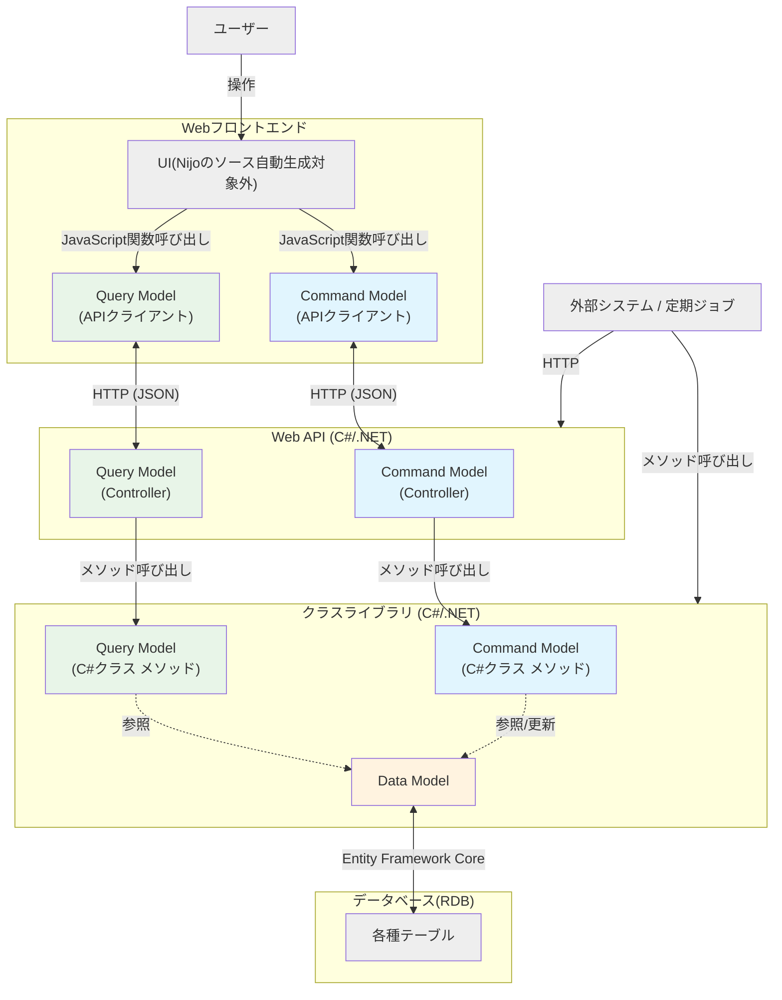

# モデリングの基礎

Nijoにおける開発の核心は「モデリング」にあります。
コードを書き始める前に、アプリケーションが扱うデータ構造を定義することで、堅牢な土台を自動生成します。

## 3つの主要モデルとアーキテクチャ

Nijoでは、**Data Model**、**Query Model**、**Command Model** という3つの主要なモデルが協調してアプリケーション全体を構成します。

### 各モデルの定義

* **[DataModel](./03_DataModel.md)**
  * **永続化されるデータの形**です。
  * RDBMSのテーブル定義や、トランザクションの境界に相当します。

* **[CommandModel](./05_CommandModel.md)**
  * **アプリケーションの利用者や外部システムが何らかのトリガーで要請を行い、結果を返す1サイクル** の定義です。
  * データの登録・更新だけでなく、「複雑なデータ構造をもつ画面の初期表示処理」や「データ集計Excel出力」といった操作もCommand Modelとして定義されます。
  * 入力（引数）を受け取り、処理を行い、出力（戻り値）を返します。

* **[QueryModel](./04_QueryModel.md)**
  * **データの一覧検索処理** です。主にGUIの一覧検索画面のために使用されます。
  * 生成される関数やメソッドの形は Command Model に類似しています。一覧検索処理は実際のアプリケーションで頻出し、かつパターンが決まっている（フィルタ、ソート、ページング等）ため自動生成に適しています。そのため、**Command Model の処理本体部分の大部分を自動生成したもの** が Query Model であると言えます。

### 技術スタックとデータの流れ

Nijoが生成するアプリケーションは、基本的にはモダンなWebアプリケーション構成（SPA + REST API）をとります。
各種モデルは、バックエンド側での処理本体や、フロントエンドのUIから呼び出される関数として自動生成されます。
開発者は、自身が構築したUIからこれらを呼び出して利用します。

また、外部システムとの連携の場合はバックエンド側の処理を直接呼び出す形となります。

各モデルは、この技術スタックの中で以下のように配置されます。

* **Command / Query Model (フロントエンド ↔ バックエンド)**
  * アプリケーションの機能的なインターフェースとして機能します。
  * **フロントエンド**: API呼び出し用のクライアントコード（TypeScript）や型定義が生成されます。
  * **バックエンド**: Web APIのエンドポイント（Controller）と、ビジネスロジックの本体（C#メソッド）が生成されます。フロントエンドからのHTTP経由での利用だけでなく、バッチ処理や外部システムからのメソッド直接呼び出しも可能になります。
  * フロントエンド・バックエンド間を跨ぐ通信（JSON/REST）の仕様もこのモデルによって決定されます。

* **Data Model (バックエンド ↔ データベース)**
  * バックエンド内部でのデータ処理と、データベースへの永続化を担当します。
  * **バックエンド**: C#のEntityクラスとして生成され、ドメインロジックの中心となります。
  * **データベース**: テーブル定義（DDL）として生成され、データを物理的に保存します。
  * フロントエンドには直接露出せず、必ず Command/Query を介して操作されます。

:::note 注意
画面UIsはNijoの生成範囲外です。開発者は独自のUIを実装し、生成されたAPIクライアントを呼び出して利用します。
:::

:::note 注意
用語としては **CQRS (Command Query Responsibility Segregation)** と似ていますが、Nijoにおける定義はそれとは必ずしも一致しません。
更新系処理と参照系処理を明確に分離するという考え方は通じるところもありますが、Nijoのモデル設計を進める上ではあまり意識しなくて構いません。
:::

## モデル間の関係

各モデルは独立して存在するのではなく、互いに関連し合っています。
Nijoでは以下の2つの関係性を定義できます。

* **参照 (Ref)**: 他のデータを指し示す関係（RDBMSの外部キーに近い）。
* **親子関係 (Child/Children)**: データの所有関係。親が消えれば子も消える、強い結びつき（集約の一部）。

---

次のページからは、各モデルの詳細な定義方法と役割について解説します。
