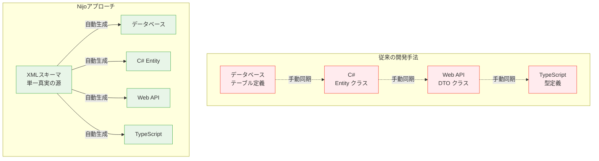
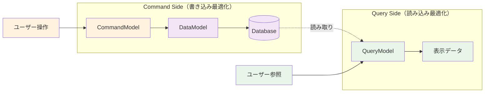
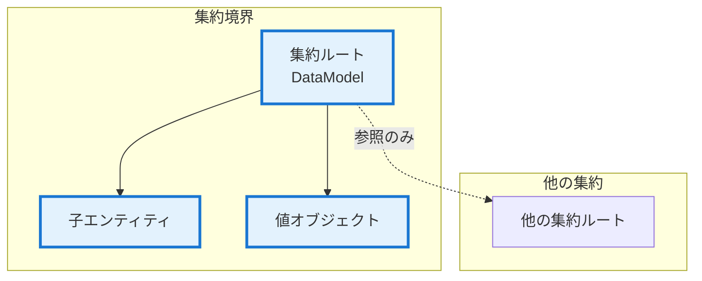
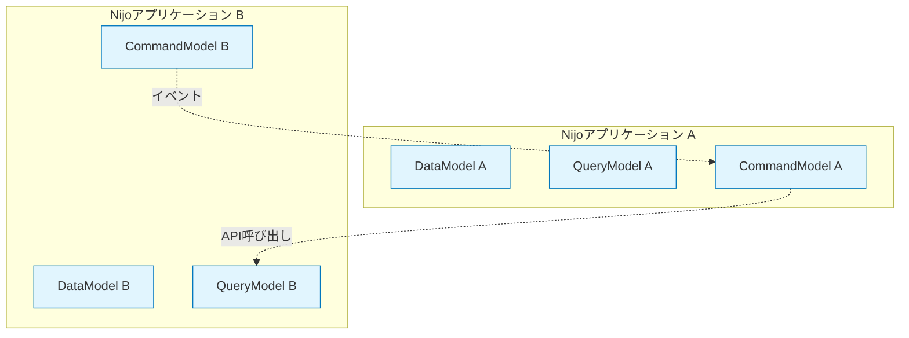
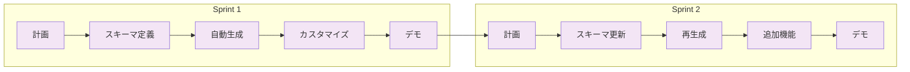
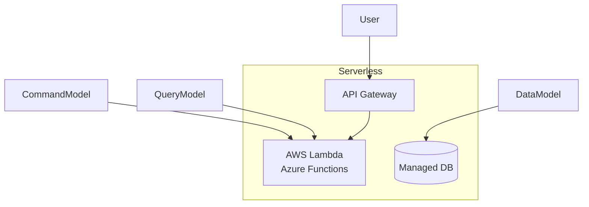
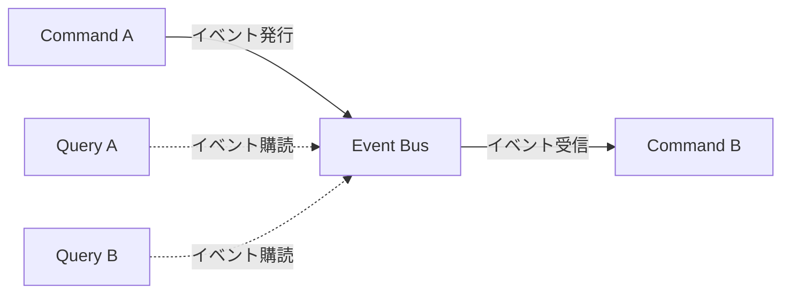
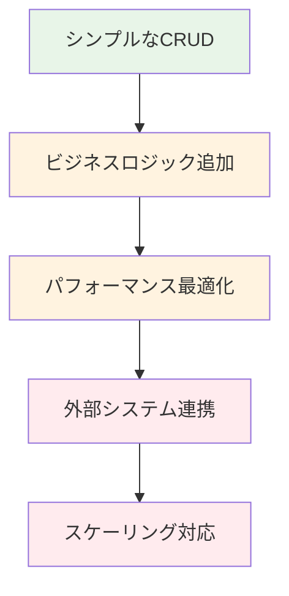

# モデル設計思想と開発手法比較

*理解指向 - 設計思想と哲学*

なぜNijoは3つのモデルアプローチを採用するのか、そして他の開発手法と何が違うのかを深く理解するためのドキュメントです。

3つのモデルがどのように協調してアプリケーションを構成するかについては、[モデル間の協調によるアプリケーション構成](./models-overview.md)を参照してください。

[[toc]]

## 🎯 なぜ3つのモデルなのか？

### 現代アプリケーション開発の根本課題

現代のWebアプリケーション開発では、**同じデータ構造を複数の技術レイヤーで重複定義**する必要があり、これが開発効率と品質の大きな障壁となっています。



### 3つのモデルが生まれた背景思想

**責務分離による複雑性管理**
単一のモデルで全てを表現しようとすると、データ永続化、表示最適化、操作処理の異なる関心事が混在し、保守性が低下します。Nijoは意図的に3つのモデルに分離することで、各々が単一の責務に集中できる設計を採用しました。

**技術制約からの解放**
従来の開発では、データベースの正規化制約と画面表示の要件、そしてAPIの設計が相互に制約し合い、どれも中途半端な設計になりがちでした。Nijoは各モデルがそれぞれの技術的要件に最適化できるよう、意図的に分離しています。

**開発プロセスの並行化**
3つのモデルが独立していることで、データ設計、画面設計、業務ロジック設計を並行して進められます。これは大規模チーム開発における生産性向上の重要な要素です。

## 🏗️ アーキテクチャ設計原則

### 1. CQRSパターンの採用理由

**Command Query Responsibility Segregation（コマンドクエリ責任分離）**



**採用理由**:
- **書き込み処理**: トランザクション整合性とビジネスルール重視
- **読み込み処理**: 表示性能と検索機能重視
- **独立最適化**: それぞれの特性に応じた最適化が可能

### 2. ドメイン駆動設計（DDD）との整合性

**DataModel = 集約ルート**


**設計原則**:
- **一貫性境界**: 1つのDataModelが整合性を保証する範囲
- **ライフサイクル管理**: 集約ルートを通じた子エンティティの管理
- **不変条件の保護**: ビジネスルールの境界の明確化

### 3. 宣言的設計の哲学

**Why 宣言的 vs 命令的？**

```xml
<!-- 宣言的：何を作りたいかを記述 -->
<顧客 node-type="data-model">
  <顧客ID key="true" type="uuid" />
  <顧客名 type="string" required="true" />
  <登録日時 type="datetime" />
</顧客>
```

**メリット**:
- **意図の明確性**: データ構造の意図が直接表現される
- **自動最適化**: フレームワークが最適な実装を選択
- **保守性**: 変更時の影響範囲の局所化

## 📊 他の開発手法との比較

### コード生成ツールとの比較

| 比較項目           | Rails Scaffold   | ASP.NET Scaffold | **Nijo**         |
| ------------------ | ---------------- | ---------------- | ---------------- |
| **生成範囲**       | 基本CRUD         | 基本CRUD         | フルスタック     |
| **設計思想**       | MVC              | MVC              | **CQRS + DDD**   |
| **型安全性**       | 部分的           | 部分的           | **完全**         |
| **カスタマイズ性** | 高               | 高               | **段階的**       |
| **保守性**         | 手動メンテナンス | 手動メンテナンス | **スキーマ駆動** |

### ローコード・ノーコードプラットフォームとの比較

| 比較項目               | Power Platform | OutSystems | **Nijo**       |
| ---------------------- | -------------- | ---------- | -------------- |
| **対象ユーザー**       | 市民開発者     | 市民開発者 | **プロ開発者** |
| **コード制御**         | 限定的         | 限定的     | **完全制御**   |
| **複雑性対応**         | 制限あり       | 制限あり   | **高い対応力** |
| **ベンダーロックイン** | あり           | あり       | **なし**       |
| **学習コスト**         | 低             | 中         | **中〜高**     |

### 従来フレームワークとの比較

| 比較項目       | Pure ASP.NET Core | Spring Boot    | **Nijo**       |
| -------------- | ----------------- | -------------- | -------------- |
| **開発速度**   | 手動実装で低速    | 手動実装で低速 | **高速**       |
| **一貫性**     | 開発者依存        | 開発者依存     | **保証される** |
| **学習コスト** | 高                | 高             | **中程度**     |
| **柔軟性**     | 最高              | 最高           | **高い**       |
| **型安全性**   | 開発者依存        | 開発者依存     | **自動保証**   |

## 🎨 設計パターンとの関係

### エンタープライズアプリケーションパターン

**Martin Fowlerのパターンとの対応**

| Nijoモデル       | 対応パターン                       | 役割                                   |
| ---------------- | ---------------------------------- | -------------------------------------- |
| **DataModel**    | Domain Model, Active Record        | ドメインロジックとデータアクセス       |
| **QueryModel**   | Data Transfer Object, Table Module | データ転送と検索処理                   |
| **CommandModel** | Service Layer, Command             | アプリケーションサービスとコマンド処理 |

### マイクロサービスアーキテクチャとの親和性



**マイクロサービス対応**:
- **境界の明確化**: DataModelがサービス境界と対応
- **独立デプロイ**: 各Nijoアプリケーションが独立
- **APIファースト**: 自動生成されるAPIでサービス間連携

## 🔄 開発プロセスの変化

### 従来のウォーターフォール型開発

```mermaid
gantt
    title 従来の開発プロセス
    dateFormat X
    axisFormat %s

    section 設計
    要件定義          :done, req, 0, 2
    DB設計           :done, db, 2, 4
    API設計          :done, api, 4, 6
    UI設計           :done, ui, 6, 8

    section 実装
    DB実装           :impl1, 8, 10
    API実装          :impl2, 10, 14
    UI実装           :impl3, 14, 20

    section テスト
    結合テスト        :test, 20, 24
```



### Nijoを使った開発プロセス

```mermaid
gantt
    title Nijoを使った開発プロセス
    dateFormat X
    axisFormat %s

    section 設計
    要件定義          :done, req, 0, 2
    モデル設計        :done, model, 2, 4

    section 実装
    スキーマ定義      :schema, 4, 6
    自動生成         :gen, 6, 7
    カスタマイズ      :custom, 7, 12

    section テスト
    結合テスト        :test, 12, 14
```



**効果**:
- **設計期間**: 66%短縮（8日→4日）
- **実装期間**: 50%短縮（12日→8日）
- **全体期間**: 42%短縮（24日→14日）

### アジャイル開発との相性

**スプリント内での高速イテレーション**



## 🚀 技術進化への対応戦略

### 技術スタックの進化対応

**現在の対応技術**
```
Backend: ASP.NET Core 8
Frontend: React + TypeScript
Database: PostgreSQL, SQLite, SQL Server
ORM: Entity Framework Core
```

**将来の拡張予定**
```
Backend: Go, Rust への拡張
Frontend: Vue.js, Svelte への対応
Database: MongoDB, DynamoDB への対応
Cloud: Azure, AWS ネイティブ機能
```

### アーキテクチャトレンドへの対応

**サーバーレスアーキテクチャ**


**イベント駆動アーキテクチャ**


## 💡 設計思想の核心原則

### 1. 開発者の認知負荷最小化

**複雑性の段階的公開**
```
Level 1: 基本的なCRUD → 自動生成で解決
Level 2: カスタムビジネスロジック → 明確な拡張ポイント
Level 3: 高度な最適化 → フルカスタマイズ可能
```

### 2. 「設定より規約」の適用

**規約による自動化**
- 命名規則による自動的なマッピング
- 型システムによる自動的なバリデーション
- パターンによる自動的なAPI生成

**必要時の設定による上書き**
- 特殊な要件に対する設定オプション
- パフォーマンス要件に対するカスタマイズ
- 既存システム連携のための拡張

### 3. 段階的な複雑性対応

**Simple → Complex の移行パス**


## 🎯 まとめ：なぜNijoなのか？

### 解決する根本問題

1. **重複実装の排除**: 同じデータ構造の多重定義
2. **型安全性の確保**: フルスタックでの一貫した型システム
3. **開発効率の向上**: 反復作業の自動化
4. **品質の標準化**: 統一されたコード構造とパターン
5. **保守性の向上**: 変更時の影響範囲の局所化

### 提供する価値

**開発チームへの価値**
- 技術的な複雑性からの解放
- ビジネスロジックへの集中
- 一貫した開発体験

**プロジェクトへの価値**
- 予測可能な開発スケジュール
- 高い品質とパフォーマンス
- 長期的な保守性

**組織への価値**
- 開発標準の統一
- 技術者育成の効率化
- システム間の整合性確保

この設計思想により、Nijoは単なるコード生成ツールではなく、**現代的なアプリケーション開発のための包括的なフレームワーク**として位置づけられます。

---

**関連ドキュメント**:
- [モデル間の協調](./models-overview.md) - 3つのモデルがどのように協調してアプリケーションを構成するか
- [🛠️ How-to Guides](../how-to-guides/) - より具体的な実装方法
- [📖 Reference](../reference/) - 技術的な詳細仕様
