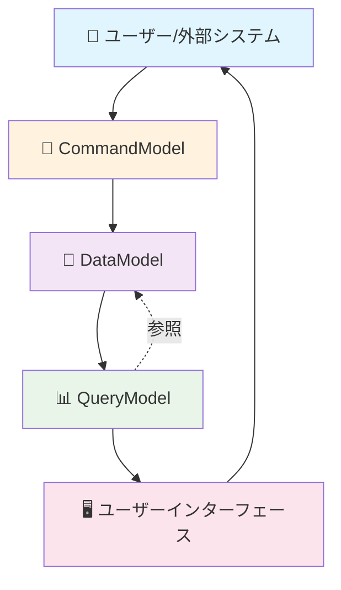

# モデル間の協調による アプリケーション構成

*理解指向 - モデルアーキテクチャの概念*

Nijoでは、**Data**、**Query**、**Command** という3つの主要なモデルが協調してアプリケーション全体を構成します。これらのモデルがなぜ必要で、どのような設計思想に基づいているかについては、[モデル設計思想と開発手法比較](./model-design-philosophy.md)を参照してください。

このページでは、これら3つのモデルが**具体的にどのように協調してアプリケーションを構成するか**に焦点を当てて説明します。

## モデル間の協調関係



### 1. データフローの基本サイクル

**書き込みフロー（Command → Data）**
1. ユーザーが操作を実行
2. CommandModelが操作を受け取り、ビジネスルールを検証
3. DataModelを通じてデータベースにデータを永続化
4. トランザクション境界内で整合性を保証

**読み込みフロー（Data → Query → UI）**
1. QueryModelがDataModelからデータを読み込み
2. 表示用に最適化された形に変換・集計
3. UIコンポーネントが構造化されたデータを受け取り表示

### 2. モデル間の明確な責務分離

**CommandModel → DataModel（書き込み経路）**
- コマンドはDataModelを直接操作してデータを変更
- ビジネスルールの実行とデータ整合性の維持
- トランザクション境界内での一貫性保証

**DataModel → QueryModel（読み込み経路）**
- QueryModelがDataModelからデータを読み取り
- 正規化されたデータの非正規化
- 複数テーブルをまたいだデータ集計
- 表示用の計算項目生成

**重要な設計原則**
CommandModelは基本的にQueryModelを参照しません。これはCQRS（コマンドクエリ責任分離）の原則に従い、書き込み処理と読み込み処理を明確に分離するためです。

## 協調による実現される利点

### 効率的な処理分離
書き込み処理（Command → Data）と読み込み処理（Data → Query）の分離により：

- **書き込み処理**: データ整合性とトランザクション管理に最適化
- **読み込み処理**: 検索性能と表示用データ変換に最適化
- **独立した拡張**: アクセスパターンに応じて各部分を独立して強化可能

## 実際のアプリケーションでの協調例

### 顧客管理システムの例

**顧客情報の登録プロセス**
```
1. UI：顧客登録フォームからデータ送信
   ↓
2. CommandModel：入力データの検証、ビジネスルール実行
   ↓
3. DataModel：顧客データの永続化、関連データの整合性確保
   ↓
（登録完了後、表示が必要な場合）
4. QueryModel：登録された顧客データの表示用変換
   ↓
5. UI：登録完了画面の表示
```

**顧客検索・一覧表示プロセス**
```
1. UI：検索条件の入力
   ↓
2. QueryModel：検索条件の解釈、データ取得・集計
   ↓
3. DataModel：効率的なデータアクセス
   ↓
4. QueryModel：表示用データの整形
   ↓
5. UI：検索結果の一覧表示
```

## 設計時の考慮点

### モデル境界の設計原則

**DataModelの境界**
- トランザクション境界と一致させる
- ビジネス上の整合性が必要な範囲で区切る
- 集約ルートの概念を適用

**QueryModelの境界**
- 画面や帳票の表示単位と一致させる
- パフォーマンス要件を考慮した集計範囲
- ユーザーの認知モデルと整合させる

**CommandModelの境界**
- ユーザーの操作単位と一致させる
- ビジネスプロセスの論理的な区切り
- エラー処理とロールバックの範囲
- CQRSの原則に従い、QueryModelとの分離を維持

### パフォーマンス最適化の協調

モデル間の協調により、効率的なデータアクセスパターンを実現：

- **事前集計**：QueryModelでの計算結果キャッシュ
- **遅延読み込み**：必要なデータのみの段階的取得
- **バッチ処理**：CommandModelでの一括処理最適化

## まとめ：協調によるアプリケーション全体の構成

3つのモデルの協調により、以下のような **一貫したアプリケーション体験** が実現されます：

### ユーザー視点での一貫性
1. **直感的な操作フロー**: 参照→判断→操作→結果確認のサイクル
2. **予測可能な応答**: 各モデルの責務が明確なため、性能特性も予測可能
3. **一貫したデータ表現**: 同じ情報が常に同じ形で表示される

### 開発者視点での明確性
1. **責務の境界**: どのモデルで何を実装すべきかが明確
2. **変更の影響範囲**: 修正が他のモデルに与える影響を予測しやすい
3. **テスト戦略**: モデルごとに独立したテスト戦略を立てられる

この協調関係により、個々のモデルの利点が相乗効果を生み、全体として **保守性、拡張性、性能を両立したアプリケーション** が構築できます。

---

**関連ドキュメント**:
- [モデル設計思想](./model-design-philosophy.md) - なぜこの設計なのかの背景思想
- [📖 Reference](../reference/) - 各モデルの技術仕様
- [🛠️ How-to Guides](../how-to-guides/) - 実際の構築手順
