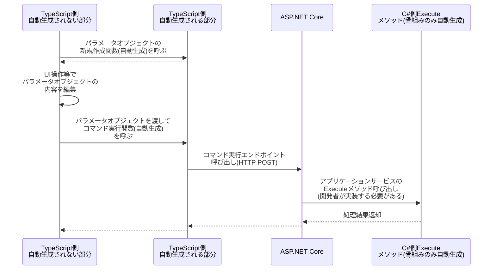

# CommandModel コマンドモデル
スキーマ定義での指定方法: `"command-model"`

ユーザーの何らかの操作をトリガーとして実行される処理を表すモデル。
いわば単なる「処理」である。

このモデルを使うまでもない単純な処理は、単にJavaScriptの関数やC#のメソッドで定義すればよいが、例えば以下のような考慮が必要な処理は、コマンドモデルを使用することでより安全にアプリケーションを構築できる。

* フロントエンドをトリガーとしてバックエンドで処理が実行され、フロントエンドに結果を返す
* フロントエンドとバックエンドで引数・戻り値の型が完全に同期されている必要がある
* 戻り値が正常終了の場合と異常終了の場合で異なる。処理が完遂された場合は本来欲しかった構造体などが返るが、入力ミスなど何らかの理由で完遂されなかった場合はどの項目でどういったエラーが出たかをユーザーに伝える情報が戻り値となる
* 特にWebアプリケーションについて、サーバー側でエラーチェックを行なった後に「～しますがよろしいですか？」という確認を経た後、（時間差でDBなどの状態が変わっている可能性があるので）もう一度エラーチェックを行なってから副作用のある処理を実行する。この2往復のHTTPリクエストを経た複雑なフローが必要になる

## コマンド処理
このコマンドを実行するためのAPIが生成される。
コマンド処理のデータフローは以下。

## 重要な特性
* CommandModelではC#側の処理の主要な内容は一切自動生成されず、すべて開発者が実装する必要がある
  * Executeメソッド内の実装はすべて開発者の責任となる
  * DataModelの更新・参照や、他システムとの連携処理などはすべて開発者が実装する
* CommandModelではパラメータの形も戻り値の形も両方ともスキーマ定義で指定する
  * 引数: Parameter属性で指定した構造体
  * 戻り値: ReturnValue属性で指定した構造体

## 外部参照時の制約
CommandModelのパラメータ (`Parameter`) または戻り値 (`ReturnValue`) の中で、他のQueryModel（`generate-default-query-model`属性が付与されたDataModelも同様）を参照する場合、以下のうちどれを参照するかを指定する必要がある。

* 画面表示用オブジェクト（DisplayData）
* 検索条件用オブジェクト（SearchCondition）

## パラメータ属性（Parameter="..."）、戻り値属性（ReturnValue="..."）

それぞれ、処理の引数と戻り値を表す。
それぞれのモデルで定義されたクラスや型を参照する形でソースコードが生成される。

以下いずれかを定義できる。

* 何も定義しない（引数なし）
* 構造体モデル
* クエリモデルの検索条件
* クエリモデルの検索結果

## TypeScriptによる開発補助のための関数等
* コマンド実行をJavaScriptから呼び出すための関数。およびそのリクエストを受け付けるためのASP.NET Core Controller Action。
* パラメータオブジェクトを新規作成する関数

## メタデータ
スキーマ定義で指定された、項目ごとの文字列長や桁数や必須か否かなどの情報自体をプロジェクトで使用したい場合に使う。
主にReact Hook Form や zod のようなバリデーション機能をもったライブラリで使用されるような使い方を想定。
C#, TypeScript それぞれで生成される。

## オプション
この集約の属性に指定することができるオプションは [こちら](./CommandModel.Options.md) を参照のこと。
