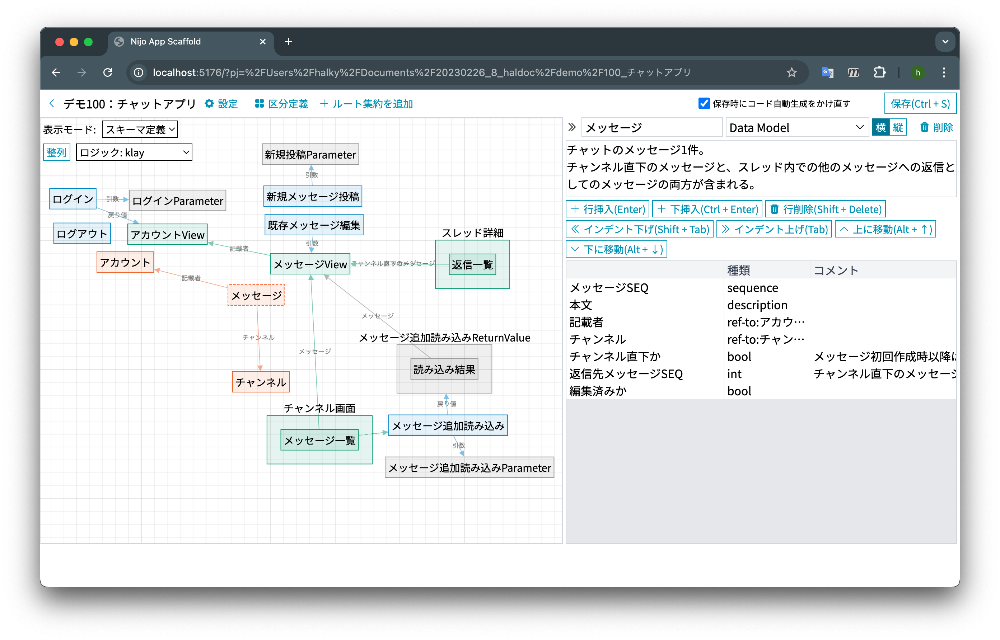

# Nijo App Scaffold

**複雑な業務を、目に見える形に。集約指向アプリケーション生成フレームワーク**

Nijoは、複雑な業務フローを持つエンタープライズアプリケーションを効率的に開発するための、フルスタック・コード生成フレームワークです。
データ構造と振る舞いを定義したスキーマを中心とし、堅牢なアプリケーションの土台を自動生成します。

## なぜ Nijo なのか？

業務アプリケーション開発において最も困難なのは、複雑なデータ構造と業務ルールの整合性を保ち続けることです。
Nijoは、 **「集約（Aggregate）」** や **「モデル (Model)」** という概念を用いてそのアプリケーションのスキーマを定義し、専用のGUIエディタで可視化することで、この課題を解決します。

### 1. 可視化によるチームの合意形成
専用のGUIエディタ (`nijo serve`) を提供しています。
エンジニアだけでなく、ドメインエキスパートやプロジェクトマネージャーも、ER図のようなグラフを見ながらデータ構造を確認できます。
「このデータが消えたら、関連するこのデータはどうなる？」「この画面で検索されるデータの構造は？」といったシステムの挙動を、コードを書く前にチーム全体で視覚的に共有・合意できます。

### 2. 集約 (Aggregate) 指向のモデリング
Nijoでは、「集約」という単位でデータを捉えます。
集約は、その種類に応じて、どのようなソースコードが自動生成されるかが変わります。
代表的な集約の種類は以下3つです。

- **データモデル**: RDBMSのテーブル定義と近いですが、単なるテーブル定義ではなく、同一トランザクションで更新されるべき複数のテーブルを1つの塊と捉えます。データモデルの集約からは Entity Framework Core の定義や、必須チェックや桁数チェックなど基本的な入力検証などのコードが生成されます。
- **クエリモデル**: エンドユーザーが検索・一覧表示する粒度で集約を定義します。クエリモデルの集約からは、検索条件オブジェクト、検索結果オブジェクト、動的WHERE句付加、ORDERBY句、ページングなどのコードが自動生成されます。
-  **コマンドモデル**: 処理。「xxxデータ更新」「ログイン」「xxxデータ複製」「月次xxx帳票作成」など。

この厳格なモデリングにより、データの不整合を防ぎ、保守性の高いシステム設計を強制します。

### 3. フルスタックかつ型安全なコード生成
定義されたモデルから、以下のレイヤーのコードを一気通貫で生成します。

- **データアクセス層**: Entity Framework Core によるテーブル定義
- **ビジネスロジック層**: 集約ごとのC#クラス定義, CRUD処理
- **プレゼンテーション層**: TypeScript 型定義, ASP.NET Core Web API, それと対応するJavaScript側のAPIクライアント

フロントエンドからバックエンド、データベースまで型定義が同期されるため、変更に強い開発が可能です。

### 4. 自動生成と手動実装の分離
自動生成されるコード（`__AutoGenerated` などといった名称のフォルダの中に生成されます）と、開発者が手動で実装するコードは、明確にファイルやフォルダが分離されています。
スキーマ定義を変更してコードを再生成しても、あなたが実装したビジネスロジックやUIコンポーネントが上書きされて消えることはありません。

生成されたクラスを継承したり、Partial Class（C#の場合）を利用したりすることで、自動生成コードに手を加えることなく振る舞いを拡張できます。
具体的な自動生成と手動実装の分離方法は以下です。

- **C#クラスライブラリ**: 「ジェネレーションギャップパターン」により分離を実現しています。
  - 中心となるクラスは `abstract class` で自動生成されます。あなたはこのクラスを継承した具象クラスを用意し、アプリケーションでは具象クラスの方を利用します。
  - 自動生成されるメソッドの処理の振る舞いを拡張したい場合、自動生成されたメソッドをオーバーライドすることで拡張します。
- **Web バックエンド**: ASP.NET Core の仕組みを利用して分離を実現しています。
  - Nijoは集約ごとのコントローラーとアクションのみを自動生成します。ASP.NET Core では通常、セットアップ処理で `.AddControllers()` を呼ぶことで、アセンブリ内で定義されているコントローラーを自動的にスキャンし、HTTPエンドポイントを作成します。この仕組みを利用して、自動生成と手動実装部分の統合を図っています。
  - つまり、Webサーバーとしての基本的な挙動は自動生成に含まれません。HTTP/HTTPSの利用、Cookie認証やOAuth認証などといった事項は、通常の ASP.NET Core アプリケーションと同様に自由に実装してください。
- **Web フロントエンド**: Nijoは Web バックエンドの定義のみを自動生成します。
  - フロントエンドは通常、アプリケーションごとに要求が千差万別なため、そのほとんどを手動実装に委ねています。Nijoは以下のみを自動生成します。
    - Web バックエンド側で自動生成されたコントローラーと完全に同期されたエンドポイント定義
    - HTTPリクエストにわたす引数の型（C#クラス定義と完全に同期されたTypeScriptの型）
    - HTTPレスポンスで帰って来る戻り値の型（C#クラス定義と完全に同期されたTypeScriptの型）
  - TypeScriptだけは使用する必要がありますが、どのようなUIライブラリやCSSフレームワークを利用するかは完全に自由です。

また、生成されるのは、モダンな技術スタックで構成された「普通の」ソースコードです。
ブラックボックスなランタイムライブラリへの依存は最小限であり、自動生成されたコードをベースに、独自の業務ロジックやUIを自由に追加・拡張できます。

## 技術スタック

Nijoが生成するアプリケーションは、以下の技術スタックを採用しています。

- **データベース**: 任意のRDBMS (EF Coreがサポートするもの) / デフォルトテンプレートはSQLite
- **バックエンド**: .NET 9 / ASP.NET Core / Entity Framework Core
- **フロントエンド**: TypeScriptのみ採用必須。それ以外のJavaScript, CSS フレームワークやライブラリの採用は任意。

## インストールと前提条件

### インストール
Releases ページから、お使いのOSに合わせた最新のバイナリ (`nijo` または `nijo.exe`) をダウンロードし、PATHの通った場所に配置してください。

### 前提条件
生成されたアプリケーションを開発・実行するには、以下の環境が必要です。

- **.NET SDK（.NET 9 以上を推奨）**: バックエンドの開発に必要です。
- **Node.js （22以上を推奨）**: フロントエンドの開発に推奨されます。

## 開発ワークフロー

Nijoは、`nijo.xml` というスキーマ定義ファイルを読み取り、各種ソースコードを生成します。
前述のGUIエディタは、単にこのXMLを編集しているだけに過ぎません。

これにより、スキーマ定義をバージョン管理システムで扱うことで、以下のような流れで開発することができます。

1. **プロジェクト作成**: `nijo new` コマンドで新しいプロジェクトを作成します。
2. **モデリング**: `nijo serve` コマンドでGUIエディタを起動します。ブラウザ上でモデルを追加・編集し、関係性を定義します。
3. **コード生成**: 定義に基づいてソースコードが自動生成されます。
4. **実装**: 自動生成されたコードをベースに、固有の業務ロジックやUIのカスタマイズを実装します。
5. **共有**: `nijo.xml` をバージョン管理システムにコミットします。チームメンバーは常に最新のモデル図を参照できます。

2から5までの工程は一度行なって終わりではなく、開発期間中を通じて継続的に行われます。

---

上記の 2, 3, 4 の部分を図で解説します。

- 「2. モデリング」は図中の緑の部分と対応します。GUIエディタは nijo.xml を編集します。
- 「3. コード生成」は図中の橙色の部分と対応します。2で更新されたnijo.xmlをもとに、各プロジェクトの橙色の網掛けの部分のソースコードが自動生成されます。
- 「4. 実装」では、開発者は3で自動生成されたソースを利用しながら、それ以外のソースを編集します。

## ドキュメント

詳細なチュートリアルやAPIリファレンスは現在準備中です。
（リンク予定地）

## ライセンス

このプロジェクトは [LICENSE.txt](./LICENSE.txt) の条件の下で提供されています。
